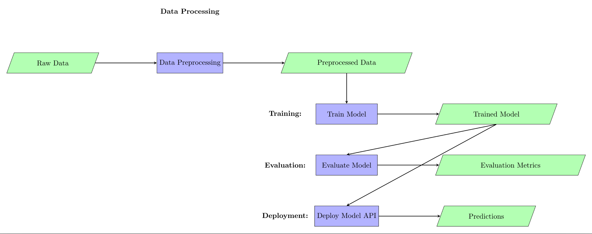

# **Cloud-Based System for Unique Visitor Detection**

## **Project Overview**
This project presents a scalable, cloud-based system designed to process vast volumes of video data from global retail environments. The primary goal is to count unique customer visits across multiple retail locations efficiently, providing actionable insights to businesses.

---

## **System Design**
The architecture of the project is visualized in the diagram below:

---

## **Functional Workflow**
### 1. **Data Processing**
- Raw data (e.g., images) is collected and preprocessed for consistency.
- Preprocessed data is passed to the training pipeline.

### 2. **Training**
- A machine learning model is trained on the processed data to classify and predict outcomes.

### 3. **Evaluation**
- The trained model is evaluated for accuracy and performance metrics are logged.

### 4. **Deployment**
- The final model is deployed as a REST API for real-time predictions.

---

## **Expected Outcome**
The system is designed to:
- Handle large-scale video data efficiently.
- Provide time-bound and location-specific visitor reports.
- Accurately identify and count unique visitors.

---

## **References**
- [EfficientNet for Face Detection](https://arxiv.org/abs/1905.11946)
- [Scalable Vector Database](https://milvus.io/)
- [Cloud-Based Architecture for AI Systems](https://www.cloudarchitecture.com)

---

**Author**: Roman Kovalev  
**Contact**: Kovalev-Roman-2001@yandex.ru  

